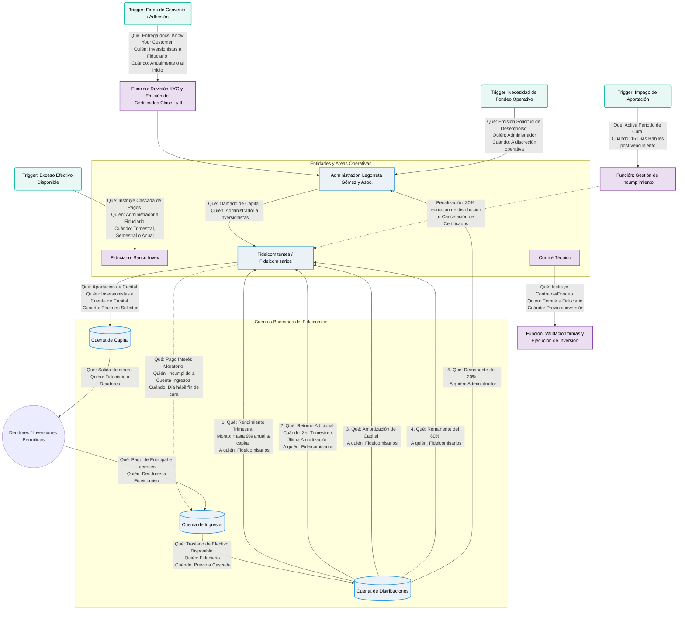

```mermaid
graph TD
    classDef account fill:#fcf3cf,stroke:#f1c40f,stroke-width:2px,color:#000
    classDef area fill:#ebdef0,stroke:#8e44ad,stroke-width:2px,color:#000
    classDef trigger fill:#e8f8f5,stroke:#1abc9c,stroke-width:2px,color:#000
    classDef money fill:#eaf2f8,stroke:#3498db,stroke-width:2px,color:#000
    
    subgraph Entidades y Areas Operativas
        FID["Fiduciario: Banco Invex"]:::area
        ADM["Administrador: Legorreta Gómez y Asoc."]:::area
        CT["Comité Técnico"]:::area
        INV["Fideicomitentes / Fideicomisarios"]:::area
    end
    
    subgraph Cuentas Bancarias del Fideicomiso
        CCAP[("Cuenta de Capital")]:::account
        CING[("Cuenta de Ingresos")]:::account
        CDIS[("Cuenta de Distribuciones")]:::account
    end
    
    %% EVENTO 1: KYC Y APORTACIONES
    TR1("Trigger: Firma de Convenio / Adhesión"):::trigger
    TR1 -->|Qué: Entrega docs. Know Your Customer <br> Quién: Inversionistas a Fiduciario <br> Cuándo: Anualmente o al inicio| OP1["Función: Revisión KYC y Emisión de <br> Certificados Clase I y II"]:::area
    OP1 --> ADM
    
    TR2("Trigger: Necesidad de Fondeo Operativo"):::trigger
    TR2 -->|Qué: Emisión Solicitud de Desembolso <br> Quién: Administrador <br> Cuándo: A discreción operativa| ADM
    ADM -->|Qué: Llamado de Capital <br> Quién: Administrador a Inversionistas| INV
    
    %% MOVIMIENTO: APORTACIONES Y PENALIZACIONES
    INV -->|Qué: Aportación de Capital <br> Quién: Inversionistas a Cuenta de Capital <br> Cuándo: Plazo en Solicitud| CCAP:::money
    
    TR3("Trigger: Impago de Aportación"):::trigger
    TR3 -->|Qué: Activa Periodo de Cura <br> Cuándo: 15 Días Hábiles post-vencimiento| OP2["Función: Gestión de Incumplimiento"]:::area
    INV -.->|Qué: Pago Interés Moratorio <br> Quién: Incumplido a Cuenta Ingresos <br> Cuándo: Día hábil fin de cura| CING:::money
    OP2 -.->|Penalización: 30% reducción de distribución <br> o Cancelación de Certificados| INV
    
    %% EVENTO 2: INVERSION
    CT -->|Qué: Instruye Contratos/Fondeo <br> Quién: Comité a Fiduciario <br> Cuándo: Previo a inversión| OP3["Función: Validación firmas y <br> Ejecución de Inversión"]:::area
    CCAP -->|Qué: Salida de dinero <br> Quién: Fiduciario a Deudores| Deudores(("Deudores / Inversiones Permitidas"))
    
    %% MOVIMIENTO: RETORNOS
    Deudores -->|Qué: Pago de Principal e Intereses <br> Quién: Deudores a Fideicomiso| CING:::money
    CING -->|Qué: Traslado de Efectivo Disponible <br> Quién: Fiduciario <br> Cuándo: Previo a Cascada| CDIS:::money
    
    %% EVENTO 3: DISTRIBUCIONES
    TR4("Trigger: Exceso Efectivo Disponible"):::trigger
    TR4 -->|Qué: Instruye Cascada de Pagos <br> Quién: Administrador a Fiduciario <br> Cuándo: Trimestral, Semestral o Anual| FID
    
    %% MOVIMIENTO: CASCADA
    CDIS -->|1. Qué: Rendimiento Trimestral <br> Monto: Hasta 9% anual s/ capital <br> A quién: Fideicomisarios| INV:::money
    CDIS -->|2. Qué: Retorno Adicional <br> Cuándo: 3er Trimestre / Última Amortización <br> A quién: Fideicomisarios| INV:::money
    CDIS -->|3. Qué: Amortización de Capital <br> A quién: Fideicomisarios| INV:::money
    CDIS -->|4. Qué: Remanente del 80% <br> A quién: Fideicomisarios| INV:::money
    CDIS -->|5. Qué: Remanente del 20% <br> A quién: Administrador| ADM:::money

```
